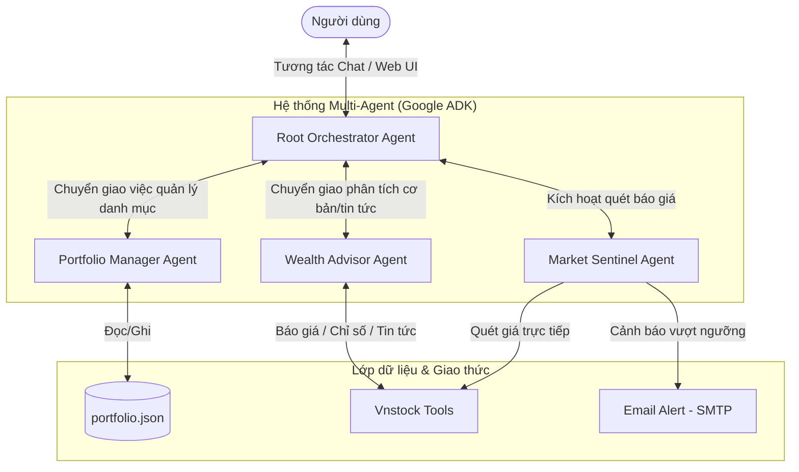

# 💰 Personal Wealth Concierge Agent (Trợ lý Tài chính & Cảnh báo Sớm)

Dự án tham gia cuộc thi **AI Agents Intensive Vibe Coding Capstone Project (Kaggle)**. 
Hệ thống là một **Trợ lý Tài chính Cá nhân đa nhiệm (Concierge Agent)** được xây dựng trên nền tảng **Google ADK** kết hợp thư viện dữ liệu chứng khoán **Vnstock**. Hệ thống quản lý danh mục đầu tư ảo, theo dõi biến động thị trường và tự động gửi email cảnh báo khi phát hiện biến động lớn.

---

## 🏛️ Kiến trúc Multi-Agent (Google ADK)

Hệ thống sử dụng mô hình **Root Orchestrator** để điều phối hội thoại (LLM Delegation) tới 3 Sub-agents chuyên biệt dựa trên nhu cầu của người dùng:



### 1. Root Orchestrator Agent
*   Đóng vai trò tiếp nhận thông tin từ người dùng, xác định ý định (Intent) và tự động chuyển giao quyền điều khiển cuộc hội thoại (LLM Delegation) cho các Sub-agents dưới quyền.

### 2. Portfolio Manager Agent
*   Quản lý danh sách tài sản nắm giữ của người dùng được lưu trữ cục bộ tại tệp cấu hình an toàn `app/portfolio.json`.
*   **Công cụ (Tools):** `get_portfolio`, `add_to_portfolio`, `remove_from_portfolio`.

### 3. Wealth Advisor Agent
*   Phân tích sâu định giá và tin tức của các mã cổ phiếu để hỗ trợ người dùng đưa ra các quyết định Mua/Bán/Giữ.
*   **Công cụ (Tools):** Lấy báo giá thị trường (`get_stock_quote`), tin tức sự kiện (`get_stock_news`), chỉ số tài chính P/E, P/B 4 kỳ gần nhất (`get_financial_ratios`).

### 4. Market Sentinel Agent
*   Giám sát thị trường chứng khoán thời gian thực.
*   **Công cụ (Tools):** Kích hoạt quét toàn bộ danh mục và tính toán biến động so với giá vốn (`run_market_scan`). Tự động soạn thảo báo cáo biến động bằng HTML và gửi tới email người dùng.

---

## 🛠️ Hướng dẫn Cài đặt & Cấu hình

### 1. Yêu cầu hệ thống
*   Python 3.11 hoặc 3.12 (khuyên dùng).
*   Công cụ quản lý gói **uv** và **google-agents-cli**.

### 2. Cài đặt các gói phụ thuộc
Di chuyển vào thư mục dự án và chạy lệnh để thiết lập môi trường ảo `.venv` và cài đặt dependencies tự động:
```bash
cd wealth-concierge-agent
agents-cli install
```

### 3. Cấu hình biến môi trường
Tạo bản sao từ `.env.example` thành `.env` nằm trong thư mục `app/` và điền đầy đủ các thông tin:
```env
# Google AI Studio Configuration (Bắt buộc để chạy LLM)
GOOGLE_API_KEY=YOUR_GEMINI_API_KEY

# Cấu hình SMTP gửi Email cảnh báo (Ví dụ cấu hình bằng Gmail)
SMTP_SERVER=smtp.gmail.com
SMTP_PORT=587
SMTP_USER=your_sender_email@gmail.com
SMTP_PASSWORD=your_gmail_app_password  # Mật khẩu ứng dụng 16 ký tự của Gmail
RECIPIENT_EMAIL=your_recipient_email@gmail.com # Địa chỉ email nhận cảnh báo

# Tần suất quét thị trường tự động (phút)
SCAN_INTERVAL_MINUTES=10
```

---

## 🚀 Hướng dẫn Chạy ứng dụng

### 1. Khởi chạy Web Dashboard & Chatbot (Streamlit)
Giao diện Streamlit cung cấp một Dashboard chuyên nghiệp giúp theo dõi cơ cấu danh mục tài sản, biểu đồ giá trị thị trường và một hộp chat tương tác trực tiếp với AI Agent.
```bash
.venv\Scripts\streamlit run dashboard.py
```

### 2. Khởi chạy Sentinel Daemon (Tiến trình quét ngầm)
Sentinel Daemon chạy tách biệt 24/7 dưới nền. Tiến trình này tự động quét dữ liệu Vnstock mỗi **10 phút** một lần, đối chiếu giá thị trường với giá vốn trong danh mục để tự động gửi email cảnh báo chủ động nếu có biến động vượt ngưỡng +/-3%.
```bash
.venv\Scripts\python app/sentinel_daemon.py
```

### 3. Chạy bộ kiểm thử Mock (Tự động hóa kiểm định logic)
Chạy bộ kiểm thử mock giả lập việc biến động giá FPT tăng 10% và tự động soạn thảo email cảnh báo mà không cần kết nối mạng thực tế (giúp demo hoạt động ngoài giờ giao dịch thị trường):
```bash
.venv\Scripts\python tests/test_sentinel_mock.py
```

### 4. Chạy Đánh giá Agent (Evaluation)
Để chạy được bộ kịch bản kiểm thử eval tích hợp sẵn của Google Agents CLI, anh cần xác thực Application Default Credentials (ADC) trên terminal:
```bash
# Xác thực tài khoản GCP
gcloud auth application-default login

# Chạy đánh giá
agents-cli eval run
```
Bộ dữ liệu kiểm định đã được thiết lập tại `tests/eval/datasets/basic-dataset.json` kiểm tra đầy đủ các kịch bản: Chào hỏi, xem danh mục, phân tích cổ phiếu và yêu cầu quét cảnh báo.

---

## 🌍 Hỗ trợ đa ngôn ngữ (Bilingual Support)

Hệ thống được thiết kế hỗ trợ song ngữ hoàn toàn (**Tiếng Anh** và **Tiếng Việt**), với **Tiếng Anh** được thiết lập làm tùy chọn ưu tiên mặc định:
* **Giao diện Web UI**: Người dùng có thể dễ dàng chuyển đổi ngôn ngữ thông qua hộp chọn (selectbox) trên thanh bên (sidebar) của Streamlit. Toàn bộ các tiêu đề, bảng biểu danh mục, biểu đồ cơ cấu tài sản, nút bấm và thông báo trạng thái sẽ tự động thay đổi theo ngôn ngữ được chọn.
* **Tương tác AI Agent**: Khi thay đổi ngôn ngữ trên giao diện, hệ thống tự động khởi tạo lại phiên làm việc (Session) của Agent và nạp chỉ thị định hướng ngôn ngữ tương ứng. AI Agent sẽ tự động chuyển đổi ngôn ngữ trò chuyện một cách mượt mà nhờ vào tập lệnh hệ thống (System Instructions) song ngữ tối ưu trong [agent.py](file:///f:/capstone/wealth-concierge-agent/app/agent.py).

---

## 🔒 Kiến trúc An toàn & Bảo mật Thông tin (Security & Privacy)

Dự án tuân thủ nghiêm ngặt tiêu chuẩn bảo mật dữ liệu và an toàn hệ thống (Zero-Trust):
1. **Cô lập thông tin nhạy cảm (Credentials Isolation)**: Không ghi cứng bất kỳ API Key, thông tin tài khoản SMTP hay mật khẩu nào trong mã nguồn. Mọi cấu hình bảo mật được nạp từ biến môi trường thông qua tệp cục bộ [app/.env](file:///f:/capstone/wealth-concierge-agent/app/.env) đã được định cấu hình trong `.gitignore` để không bị lộ lọt khi đẩy lên các kho lưu trữ công khai như GitHub.
2. **Lưu trữ dữ liệu nội bộ (Local Data Privacy)**: Dữ liệu danh mục tài sản cá nhân được quản lý cục bộ thông qua tệp [app/portfolio.json](file:///f:/capstone/wealth-concierge-agent/app/portfolio.json) của người dùng. Hệ thống không sử dụng hoặc đồng bộ dữ liệu này lên bất kỳ máy chủ bên thứ ba nào ngoại trừ việc tương tác trực tuyến với thư viện Vnstock để lấy báo giá thị trường công khai.
3. **Phòng chống lỗi đầu vào (Input Sanitization)**: Mọi mã cổ phiếu do người dùng nhập từ giao diện UI hoặc hội thoại Chatbot đều được chuẩn hóa (chuyển chữ hoa, loại bỏ khoảng trắng) và xác thực kiểu dữ liệu nghiêm ngặt trước khi ghi nhận để phòng tránh các lỗi định dạng hoặc tấn công chèn mã độc.
4. **Kiểm tra an toàn thực thi**: Toàn bộ luồng xử lý I/O tệp tin, giao tiếp mạng (Vnstock API) và kết nối SMTP đều được bao bọc trong các khối xử lý ngoại lệ (`try-except`) giúp hệ thống vận hành bền bỉ và không gây sập ứng dụng (crash-resistant).

